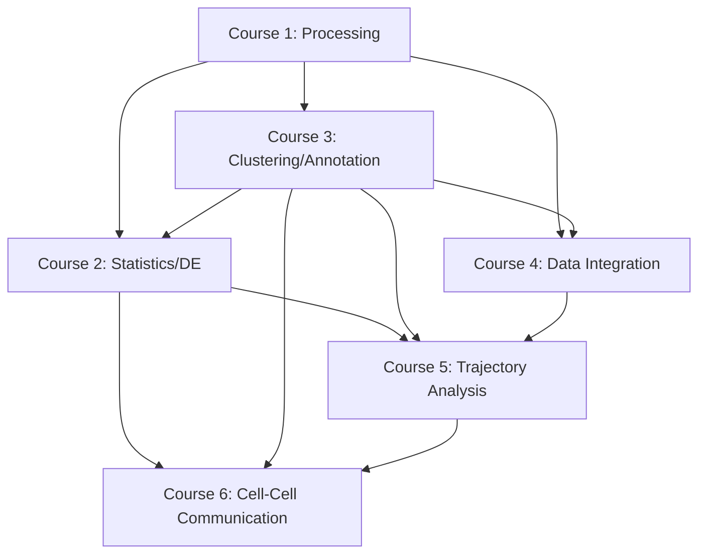

# Master Training Guide: Complete Single-Cell RNA-seq Analysis Curriculum

**From Raw Sequencing Data to Biological Insight**

---

## Program Overview

| | |
|---|---|
| **Total Duration** | 16-17 weeks (90-110 hours) |
| **Format** | Self-paced with hands-on labs |
| **Level** | Beginner to Advanced |
| **Prerequisites** | Basic R/Python, command line, genomics concepts |

### Program Learning Outcomes

By completing this comprehensive training program, you will be able to:
1. Process raw scRNA-seq data into high-quality count matrices
2. Perform rigorous differential expression analysis on bulk and single-cell data
3. Cluster cells and annotate cell types using multiple approaches
4. Integrate multi-batch datasets and correct for batch effects
5. Infer developmental trajectories and cellular differentiation pathways
6. Analyze cell-cell communication networks and signaling pathways
7. Build reproducible, publication-quality analysis pipelines

---

## Curriculum Structure

```
┌─────────────────────────────────────────────────────────────────┐
│                    COMPLETE TRAINING PATH                        │
└─────────────────────────────────────────────────────────────────┘

FOUNDATION (Weeks 1-3)
└─ Course 1: Single-Cell Processing
   └─ Raw FASTQ → QC'd Count Matrix

CORE ANALYSIS (Weeks 4-10)
├─ Course 2: Statistics & Differential Expression (Weeks 4-7)
│  └─ Bulk & scRNA-seq DE, pseudobulk methods
├─ Course 3: Clustering & Annotation (Weeks 8-10)
│  └─ Dimensionality reduction → cell type identification
└─ Course 4: Data Integration (Weeks 11-13)
   └─ Batch correction & multi-dataset atlases

ADVANCED TOPICS (Weeks 14-17)
├─ Course 5: Trajectory Analysis (Weeks 14-16)
│  └─ Pseudotime, RNA velocity, fate prediction
└─ Course 6: Cell-Cell Communication (Weeks 17-20)
   └─ Ligand-receptor inference, signaling networks
```

---

## Course Prerequisites & Dependencies



**Recommended Order:**
1. Course 1 (mandatory foundation)
2. Courses 2 & 3 (can be done in parallel or sequentially)
3. Course 4
4. Course 5
5. Course 6

---

# Course 1: Single-Cell RNA-seq Sample Processing

**Duration:** 3 weeks (15-20 hours)  
**Level:** Beginner to Intermediate  
**Prerequisites:** Basic command line, familiarity with genomics concepts

## Quick Reference
- **START_HERE:** `1.single_cell_processing_course/START_HERE.md`
- **Glossary:** `1.single_cell_processing_course/glossary.md`
- **Setup:** `1.single_cell_processing_course/setup.md`

## Learning Objectives
1. Process raw scRNA-seq FASTQ files into a count matrix
2. Apply industry-standard QC metrics and filtering strategies
3. Detect and remove technical artifacts (doublets, empty droplets)
4. Export data in standard formats for downstream analysis
5. Build reproducible processing pipelines

## Course Structure

### Week 1: Foundations & Raw Data

#### Module 1: Introduction (2 hrs)
- Why processing quality matters
- Pipeline overview
- Platform differences (10x, Smart-seq2, Drop-seq)
- **Lab 1:** Explore a published dataset structure

#### Module 2: Experimental Design & Metadata (1.5 hrs)
- Critical design decisions
- Metadata tracking
- Batch structure planning
- **Lab 2:** Create metadata template

#### Module 3: FASTQ Files & Read Structure (2 hrs)
- FASTQ anatomy
- Cell barcodes, UMIs, cDNA structure
- Protocol-specific configurations
- **Lab 3:** Inspect FASTQ files

### Week 2: Alignment & Quantification

#### Module 4: Reference Preparation (1.5 hrs)
- Genome, annotation, transcriptome
- Version matching
- Custom references
- **Lab 4:** Download and prepare reference

#### Module 5: Alignment & Quantification Pipelines (3 hrs)
- Full vs pseudo-alignment
- Cell Ranger deep dive
- STARsolo and kallisto|bustools
- **Lab 5A:** Run Cell Ranger
- **Lab 5B:** Run kallisto|bustools

#### Module 6: Cell Barcode Detection & UMI Deduplication (2 hrs)
- Cell calling problem
- Knee plots and EmptyDrops
- UMI collapsing
- **Lab 6:** Visualize barcode rank plot

### Week 3: QC & Filtering

#### Module 7: The Count Matrix (1 hr)
- Matrix structure
- Sparse matrix formats
- **Lab 7:** Load and explore count matrix

#### Module 8: Quality Control Metrics (2.5 hrs)
- Per-cell metrics (genes, UMIs, mito%)
- Per-gene metrics
- QC distributions
- **Lab 8:** Generate QC plots

#### Module 9: Filtering Strategies (2 hrs)
- Cell filtering thresholds
- Dangers of over-filtering
- Doublet detection
- **Lab 9:** Apply filters, detect doublets

#### Module 10: Data Export & Reproducibility (1.5 hrs)
- Output formats (MTX, H5, H5AD, Loom)
- What to save
- Reproducibility checklist
- **Lab 10:** Export filtered matrix

## Assessments
- **Assignment 1:** FASTQ inspection report (Module 3)
- **Assignment 2:** Pipeline comparison (Module 5)
- **Assignment 3:** QC report with filtering decisions (Modules 8-9)
- **Final Project:** Process real dataset end-to-end

## Required Software
- Cell Ranger 8.x
- STAR 2.7.x (for STARsolo)
- kallisto + bustools
- Python 3.10+ with scanpy
- R 4.x with Seurat (optional)

---

# Course 2: Statistics & Differential Expression

**Duration:** 4 weeks (20-25 hours)  
**Level:** Beginner to Intermediate  
**Prerequisites:** Basic R or Python, familiarity with gene expression

## Quick Reference
- **START_HERE:** `2.statistics_de_course/START_HERE.md`
- **Course Details:** `2.statistics_de_course/course_statistics_de.md`
- **Glossary:** `2.statistics_de_course/glossary.md`

## Learning Objectives
1. Understand probability distributions underlying RNA-seq data
2. Perform differential expression analysis on bulk RNA-seq
3. Apply pseudobulk DE methods for single-cell data
4. Correctly interpret DE results and avoid common pitfalls
5. Visualize and communicate findings effectively

## Course Structure

### Week 1: Foundations

#### Module 1: Introduction to Transcriptomics Data (1.5 hrs)
- What is transcriptomics?
- Bulk vs single-cell vs spatial
- Count matrix structure
- **Lab 1:** Explore count matrix

#### Module 2: Probability Distributions (2 hrs)
- Why we need probability models
- Poisson distribution
- Negative binomial distribution
- Zero-inflated models
- **Lab 2:** Visualize and fit distributions

#### Module 3: Experimental Design (2 hrs)
- Biological vs technical replicates
- Confounders
- Design matrices
- Power analysis basics
- **Lab 3:** Build design matrices

### Week 2: Normalization & Testing

#### Module 4: Normalization Methods (2 hrs)
- Why raw counts are misleading
- Library size normalization
- TMM and median-of-ratios
- scRNA-seq normalization
- **Lab 4:** Compare normalization methods

#### Module 5: Hypothesis Testing (2.5 hrs)
- Null hypothesis and test statistics
- p-values interpretation
- Type I and Type II errors
- Common statistical tests
- **Lab 5:** Run t-tests and Wilcoxon tests

#### Module 6: Multiple Testing Correction (1.5 hrs)
- Multiple testing problem
- Bonferroni correction
- False Discovery Rate (FDR)
- **Lab 6:** Apply FDR correction

### Week 3: DE Methods

#### Module 7: Effect Size & Biological Meaning (1.5 hrs)
- Statistical vs biological significance
- Log2 fold change
- Shrinkage estimators
- **Lab 7:** Calculate effect sizes

#### Module 8: Bulk RNA-seq DE with DESeq2 (3 hrs)
- DESeq2 workflow
- Negative binomial GLM
- Running DESeq2 step-by-step
- Interpreting output
- **Lab 8A:** Full DESeq2 analysis
- **Lab 8B:** Multi-factor designs

#### Module 9: Alternative Bulk DE Tools (1.5 hrs)
- edgeR approach
- limma-voom
- Tool selection
- **Lab 9:** Compare DESeq2, edgeR, limma

### Week 4: Single-Cell DE

#### Module 10: scRNA-seq DE Challenges (1.5 hrs)
- Why scRNA-seq DE is different
- Dropout and sparsity
- Cell-level vs sample-level inference
- **Lab 10:** Explore scRNA-seq distributions

#### Module 11: Pseudobulk Analysis (2 hrs)
- Aggregating cells to samples
- Applying bulk methods
- When pseudobulk is appropriate
- **Lab 11:** Pseudobulk DE with DESeq2

#### Module 12: Cell-Level DE Methods (1.5 hrs)
- Wilcoxon tests
- MAST hurdle models
- Limitations and use cases
- **Lab 12:** Compare Wilcoxon vs pseudobulk

#### Module 13: Visualization (2 hrs)
- Volcano plots
- MA plots
- Heatmaps
- Gene set enrichment
- **Lab 13:** Create publication-quality visualizations

## Assessments
- **Assignment 1:** Design matrix construction (Module 3)
- **Assignment 2:** Multiple testing simulation (Module 6)
- **Assignment 3:** Complete DESeq2 analysis (Module 8)
- **Assignment 4:** Pseudobulk vs cell-level comparison (Modules 11-12)
- **Final Project:** End-to-end DE analysis on published dataset

## Required Software
```r
# R packages
BiocManager::install(c("DESeq2", "edgeR", "limma", "airway", 
                       "org.Hs.eg.db", "clusterProfiler"))
install.packages(c("ggplot2", "pheatmap", "EnhancedVolcano"))
```

---

# Course 3: Clustering & Cell Type Annotation

**Duration:** 3 weeks (15-20 hours)  
**Level:** Beginner to Intermediate  
**Prerequisites:** scRNA-seq processing, basic R/Python

## Quick Reference
- **START_HERE:** `3.clustering_annotation_course/START_HERE.md`
- **Course Details:** `3.clustering_annotation_course/course_clustering_annotation.md`
- **Glossary:** `3.clustering_annotation_course/glossary.md`

## Learning Objectives
1. Apply dimensionality reduction (PCA, UMAP, t-SNE)
2. Cluster cells using graph-based methods
3. Identify marker genes for clusters
4. Annotate cell types manually and automatically
5. Evaluate and refine annotations

## Course Structure

### Week 1: Dimensionality Reduction

#### Module 1: Why Reduce Dimensions? (1.5 hrs)
- Curse of dimensionality
- Visualization vs analysis
- Overview of DR methods
- **Lab 1:** Explore high-dimensional data

#### Module 2: Principal Component Analysis (2 hrs)
- Linear algebra foundations
- PCA step-by-step
- Choosing number of PCs
- Highly variable genes
- **Lab 2:** Run PCA, select PCs

#### Module 3: Non-linear Methods (2 hrs)
- t-SNE: perplexity and local structure
- UMAP: global structure preservation
- Comparing t-SNE vs UMAP
- Parameter tuning
- **Lab 3:** Generate UMAP/t-SNE embeddings

### Week 2: Clustering

#### Module 4: Clustering Fundamentals (1.5 hrs)
- What is a cluster?
- Distance metrics
- Clustering approaches
- **Lab 4:** Explore cell-cell distances

#### Module 5: Graph-Based Clustering (2.5 hrs)
- k-NN and SNN graphs
- Louvain algorithm
- Leiden algorithm
- Resolution parameter
- **Lab 5A:** Build graphs and cluster
- **Lab 5B:** Explore resolution effects

#### Module 6: Evaluating Clusters (1.5 hrs)
- Quality metrics
- Silhouette scores
- Biological validation
- **Lab 6:** Assess cluster quality

### Week 3: Annotation

#### Module 7: Marker Gene Identification (2 hrs)
- Differential expression for markers
- Statistical tests
- Effect size and specificity
- Visualization
- **Lab 7:** Find and visualize markers

#### Module 8: Manual Annotation (2 hrs)
- Using known markers
- Literature and databases
- Workflow best practices
- Handling ambiguity
- **Lab 8:** Manually annotate PBMC

#### Module 9: Automated Annotation (2 hrs)
- Reference-based: SingleR, scmap
- Marker-based: CellTypist, scType
- Comparing approaches
- **Lab 9:** Run automated annotation

#### Module 10: Refinement & QC (1.5 hrs)
- Sub-clustering
- Merging over-split clusters
- Doublet contamination
- Documentation
- **Lab 10:** Refine final labels

## Assessments
- **Assignment 1:** Dimensionality reduction comparison (Modules 2-3)
- **Assignment 2:** Clustering at multiple resolutions (Modules 5-6)
- **Assignment 3:** Complete cell type annotation (Modules 7-9)
- **Final Project:** Annotate novel dataset end-to-end

## Required Software
```python
# Python
pip install scanpy anndata leidenalg celltypist

# R
install.packages("Seurat")
BiocManager::install(c("SingleR", "celldex", "scmap"))
```

---

# Course 4: Data Integration & Batch Correction

**Duration:** 3 weeks (15-20 hours)  
**Level:** Intermediate  
**Prerequisites:** scRNA-seq processing, clustering & annotation

## Quick Reference
- **START_HERE:** `4.data_integration_course/START_HERE.md`
- **Course Details:** `4.data_integration_course/course_data_integration.md`
- **Glossary:** `4.data_integration_course/glossary.md`

## Learning Objectives
1. Identify and diagnose batch effects
2. Apply linear and non-linear batch correction
3. Integrate datasets across conditions/technologies
4. Evaluate integration quality quantitatively
5. Build multi-sample atlases

## Course Structure

### Week 1: Understanding Batch Effects

#### Module 1: What Are Batch Effects? (1.5 hrs)
- Technical vs biological variation
- Sources of batch effects
- Impact on analysis
- **Lab 1:** Visualize batch effects

#### Module 2: Diagnosing Batch Effects (2 hrs)
- Visual inspection
- Quantitative metrics (LISI, kBET)
- When correction is needed
- **Lab 2:** Compute batch metrics

#### Module 3: Simple Correction Methods (2 hrs)
- Regressing out batch
- ComBat
- Limitations of linear methods
- **Lab 3:** Apply regression correction

### Week 2: Integration Methods

#### Module 4: Mutual Nearest Neighbors (2 hrs)
- MNN concept
- fastMNN in R
- Use cases
- **Lab 4:** Run MNN integration

#### Module 5: Harmony (2 hrs)
- Iterative clustering approach
- PCA embedding correction
- Speed and scalability
- **Lab 5:** Integrate with Harmony

#### Module 6: Seurat Integration (2 hrs)
- Canonical Correlation Analysis
- Anchor identification
- CCA vs RPCA
- **Lab 6:** Seurat v5 workflow

#### Module 7: Deep Learning Methods (2 hrs)
- Variational autoencoders
- scVI: unsupervised integration
- scANVI: semi-supervised
- **Lab 7:** Run scVI integration

### Week 3: Evaluation & Applications

#### Module 8: Evaluating Integration Quality (2 hrs)
- Batch mixing metrics
- Biological conservation
- scIB benchmarking
- **Lab 8:** Comprehensive evaluation

#### Module 9: Choosing the Right Method (1.5 hrs)
- Method comparison studies
- Decision tree
- When integration fails
- **Lab 9:** Compare 3 methods

#### Module 10: Reference Mapping (2 hrs)
- Mapping queries to references
- Label transfer
- Azimuth
- **Lab 10:** Map to PBMC reference

## Assessments
- **Assignment 1:** Diagnose batch effects (Modules 2-3)
- **Assignment 2:** Compare Harmony vs Seurat (Modules 5-6)
- **Assignment 3:** Full evaluation report (Module 8)
- **Final Project:** Integrate multi-batch dataset

## Integration Methods Comparison

| Method | Approach | Speed | Best For |
|--------|----------|-------|----------|
| Harmony | Iterative clustering | Fast | Large datasets |
| Seurat CCA | Anchor-based | Medium | Similar datasets |
| Seurat RPCA | Reference projection | Medium | Query → Reference |
| MNN | Nearest neighbors | Medium | Few shared types |
| scVI | Deep learning | Slow (GPU) | Complex batches |
| scANVI | Semi-supervised | Slow (GPU) | With labels |

---

# Course 5: Trajectory & Pseudotime Analysis

**Duration:** 3 weeks (15-20 hours)  
**Level:** Intermediate to Advanced  
**Prerequisites:** Clustering & annotation, basic statistics

## Quick Reference
- **START_HERE:** `5.trajectory_analysis_course/START_HERE.md`
- **Course Details:** `5.trajectory_analysis_course/course_trajectory_analysis.md`

## Learning Objectives
1. Understand when trajectory analysis is appropriate
2. Infer pseudotime ordering using multiple methods
3. Construct and interpret lineage trees
4. Identify genes changing along trajectories
5. Apply RNA velocity for directional inference

## Course Structure

### Week 1: Foundations

#### Module 1: When Cells Form Trajectories (1.5 hrs)
- Continuous vs discrete states
- Biological contexts
- Snapshot data and temporal inference
- **Lab 1:** Explore developmental data

#### Module 2: Pseudotime Concepts (2 hrs)
- What is pseudotime?
- Assumptions and limitations
- Root cell selection
- Linear vs branching
- **Lab 2:** Visualize pseudotime

#### Module 3: Diffusion-Based Methods (2 hrs)
- Diffusion maps
- PAGA
- Combining with embeddings
- **Lab 3:** Run diffusion pseudotime

### Week 2: Trajectory Inference

#### Module 4: Monocle 3 (2.5 hrs)
- UMAP + graph learning
- Principal graph
- Choosing root nodes
- Multiple lineages
- **Lab 4:** Complete Monocle 3 workflow

#### Module 5: Slingshot (2 hrs)
- Cluster-based inference
- Lineage identification
- Smooth curves
- **Lab 5:** Run Slingshot

#### Module 6: RNA Velocity (2.5 hrs)
- Spliced vs unspliced RNA
- Velocity estimation
- scVelo models
- Interpreting arrows
- **Lab 6:** Compute RNA velocity

### Week 3: Downstream Analysis

#### Module 7: Trajectory DE (2 hrs)
- Genes changing along pseudotime
- GAMs and splines
- tradeSeq
- **Lab 7:** Find pseudotime-associated genes

#### Module 8: Gene Dynamics Visualization (1.5 hrs)
- Expression heatmaps
- Gene cascades
- Branch-specific expression
- **Lab 8:** Visualize gene dynamics

#### Module 9: CellRank (2 hrs)
- Markov chains for fate prediction
- Combining velocity with transcriptomics
- Terminal states
- **Lab 9:** Predict cell fates

#### Module 10: Method Comparison (1.5 hrs)
- Benchmark studies
- Choosing the right method
- Validation strategies
- **Lab 10:** Compare methods

## Assessments
- **Assignment 1:** Pseudotime inference comparison (Modules 3-4)
- **Assignment 2:** RNA velocity analysis (Module 6)
- **Assignment 3:** Trajectory DE and visualization (Modules 7-8)
- **Final Project:** Complete trajectory analysis

## Methods Summary

| Method | Approach | Branches | Direction |
|--------|----------|----------|-----------|
| Diffusion PT | Random walks | No | Needs root |
| PAGA | Graph abstraction | Yes | Needs root |
| Monocle 3 | Principal graph | Yes | Needs root |
| Slingshot | MST + curves | Yes | Needs root |
| RNA Velocity | Splicing dynamics | Implicit | Intrinsic |
| CellRank | Markov chains | Yes | From velocity |

---

# Course 6: Cell-Cell Communication Analysis

**Duration:** 4 weeks (20-25 hours)  
**Level:** Intermediate to Advanced  
**Prerequisites:** scRNA-seq processing, clustering & annotation

## Quick Reference
- **START_HERE:** `6.cell_cell_communication_course/START_HERE.md`
- **Course Details:** `6.cell_cell_communication_course/course_cell_communication.md`
- **Glossary:** `6.cell_cell_communication_course/glossary.md`

## Learning Objectives
1. Understand biological basis of cell-cell communication
2. Run CCC inference tools (CellChat, CellPhoneDB, NicheNet)
3. Critically compare results across methods
4. Build and visualize communication networks
5. Integrate spatial context

## Course Structure

### Week 1: Foundations

#### Module 1: What is Cell-Cell Communication? (2 hrs)
- Why cells communicate
- Signaling modes
- Key molecules
- Signaling cascades
- **Lab 1:** Explore L-R databases

#### Module 2: From Expression to Interaction (2 hrs)
- Core assumption
- Limitations
- L-R databases
- Statistical approaches
- **Lab 2:** Prepare data for CCC

#### Module 3: scRNA-seq Prerequisites (1.5 hrs)
- Annotation quality
- Handling dropout
- Choosing resolution
- **Lab 3:** Annotate for CCC

### Week 2: Core Tools

#### Module 4: CellPhoneDB (2.5 hrs)
- Overview and database
- Permutation testing
- Running CellPhoneDB
- Interpreting output
- **Lab 4:** Run CellPhoneDB

#### Module 5: CellChat (3 hrs)
- Probability-based inference
- Communication probability
- Network centrality
- Running CellChat
- Visualization
- **Lab 5A:** Run CellChat
- **Lab 5B:** Compare conditions

#### Module 6: NicheNet (2 hrs)
- Ligand → target genes
- Prior knowledge integration
- Ligand activity prediction
- **Lab 6:** Run NicheNet

### Week 3: Comparison & Spatial

#### Module 7: LIANA Consensus (2 hrs)
- Why consensus?
- Unified interface
- Aggregate scoring
- **Lab 7:** Run LIANA

#### Module 8: Benchmarking (2 hrs)
- Why tools disagree
- Benchmark studies
- Tool selection
- **Lab 8:** Compare 3 tools

#### Module 9: Spatial CCC (2.5 hrs)
- Why spatial context matters
- Spatial technologies
- Distance-weighted scoring
- Spatial CCC tools
- **Lab 9:** Integrate spatial info

### Week 4: Networks & Applications

#### Module 10: CCC as Graph Problem (2 hrs)
- Graph formulation
- Network metrics
- Visualization
- **Lab 10:** Build CCC networks

#### Module 11: Machine Learning for CCC (2 hrs)
- Embedding-based scoring
- Graph neural networks
- Predictive models
- **Lab 11:** ML-enhanced CCC

#### Module 12: Biological Interpretation (2 hrs)
- Networks to hypotheses
- Disease contexts
- Validation strategies
- Reporting standards
- **Lab 12:** Interpret in disease context

## Assessments
- **Assignment 1:** Prepare annotated data (Modules 2-3)
- **Assignment 2:** CellPhoneDB vs CellChat (Modules 4-5)
- **Assignment 3:** NicheNet + LIANA consensus (Modules 6-7)
- **Assignment 4:** Build CCC network (Module 10)
- **Final Project:** Complete CCC analysis on disease dataset

## Required Software
```r
# R
devtools::install_github("sqjin/CellChat")
devtools::install_github("saeyslab/nichenetr")
devtools::install_github("saezlab/liana")

# Python
pip install cellphonedb scanpy liana
```

---

# Cross-Course Integration

## Suggested Full-Program Schedule

### 4-Month Intensive Track (20-25 hrs/week)
- **Month 1:** Course 1 + Course 2 (Weeks 1-4)
- **Month 2:** Course 3 + Course 4 (Weeks 5-8)
- **Month 3:** Course 5 (Weeks 9-12)
- **Month 4:** Course 6 (Weeks 13-16)

### 6-Month Standard Track (12-15 hrs/week)
- **Months 1-1.5:** Course 1
- **Months 1.5-3:** Course 2
- **Months 3-4:** Course 3
- **Months 4-5:** Course 4
- **Months 5-5.5:** Course 5
- **Months 5.5-6.5:** Course 6

### 9-Month Relaxed Track (8-10 hrs/week)
- Linear progression through all 6 courses with extra time for practice

## Capstone Project

After completing all courses, consider a final integrative capstone project:

**Project Requirements:**
1. Process raw scRNA-seq data (Course 1)
2. Perform pseudobulk DE analysis (Course 2)
3. Cluster and annotate cell types (Course 3)
4. Integrate multiple batches (Course 4)
5. Identify developmental trajectories (Course 5)
6. Analyze cell-cell communication networks (Course 6)

**Deliverables:**
- Complete analysis pipeline (reproducible code)
- Comprehensive report with all visualizations
- Biological interpretation (2-3 pages)
- Public repository with documentation

---

# Resources & Support

## Marker Databases
- PanglaoDB: https://panglaodb.se/
- CellMarker: http://bio-bigdata.hrbmu.edu.cn/CellMarker/
- Azimuth: https://azimuth.hubmapconsortium.org/

## Reference Atlases
- Human Cell Atlas: https://www.humancellatlas.org/
- Tabula Sapiens: https://tabula-sapiens-portal.ds.czbiohub.org/
- Mouse Cell Atlas: http://bis.zju.edu.cn/MCA/

## Tool Documentation
- Scanpy: https://scanpy.readthedocs.io
- Seurat: https://satijalab.org/seurat/
- Cell Ranger: https://www.10xgenomics.com/support/software/cell-ranger
- DESeq2: https://bioconductor.org/packages/DESeq2
- CellChat: https://sqjin.github.io/CellChat/

## Community Support
- Bioconductor Support: https://support.bioconductor.org/
- scRNA-tools Database: https://www.scrna-tools.org/
- Single Cell Best Practices: https://www.sc-best-practices.org/

---

# Certificate Criteria

To earn the **Complete Single-Cell RNA-seq Analysis Certificate**, you must:

- [ ] Complete all 6 courses with ≥70% on quizzes
- [ ] Submit all practical assignments (20 total)
- [ ] Complete all 6 final projects
- [ ] Complete capstone integrative project
- [ ] Document all analyses with reproducible code
- [ ] Create public repository showcasing your work

**Estimated Total Time:** 90-110 hours over 16-20 weeks

---

*This comprehensive curriculum prepares you for independent, publication-quality single-cell RNA-seq analysis and establishes you as a computational biologist capable of extracting biological insight from complex transcriptomic data.*

**Last Updated:** February 2, 2026
